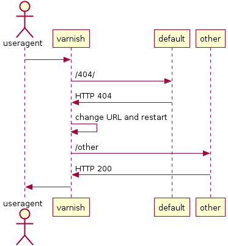
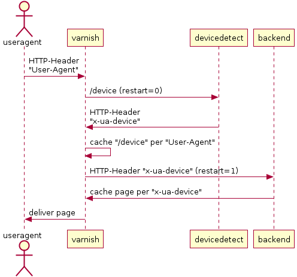

# Varnish Examples

> A collection of varnish examples

## Table of Contents

<!-- !toc (minlevel=2 omit="Table of Contents") -->

* [Prerequisites](#prerequisites)
* [Examples](#examples)
  * [Alive Page](#alive-page)
  * [Switch to a different backend per URL](#switch-to-a-different-backend-per-url)
  * [Listen to another port and redirect the request to the same server](#listen-to-another-port-and-redirect-the-request-to-the-same-server)
  * [Whitelist cookies](#whitelist-cookies)
  * [Do not cache 30x Redirects](#do-not-cache-30x-redirects)
  * [Using restart if content not found at backend](#using-restart-if-content-not-found-at-backend)
  * [Device detection with restart](#device-detection-with-restart)
* [References](#references)

<!-- toc! -->

## Prerequisites

- Varnish 4.0 [conf](conf/) / 3.0 [conf3](conf3/)
- node.js
- curl

[`conf`](conf/) contains the examples for Varnish 4.0; [`conf3`](conf3/) contains the samples for Varnish 3.0

## Examples

### Alive Page

Check if varnish is up and running (e.g. if using with [monit][])

Source: [alive.vcl](conf/alive.vcl)

````sh
# start the varnish webcache locally
varnishd -F -n $(pwd) -a 127.0.0.1:8000 -f conf/alive.vcl

curl -v http://localhost:8000/alive
````

### Switch to a different backend per URL

Use varnish to change to a different backend per URL.

Source: [other.vcl](conf/other.vcl)

````sh
# start a http backend server
node src/backend.js &
varnishd -F -n $(pwd) -a 127.0.0.1:8000 -f conf/other.vcl

curl -v http://localhost:8000/
curl -v http://localhost:8000/other/

# Wait some seconds - Age shall be greater than "0"
curl -v http://localhost:8000/
< Age: 5
3000:/ GET

curl -v http://localhost:8000/other/
< Age: 6
4000:/other/ GET

# POST requests shall be passed - Age shall always be "0"
curl -v http://localhost:8000/ -X POST
< Age: 0
3000:/ POST

curl -v http://localhost:8000/other/ -X POST
< Age: 0
4000:/other/ POST
````

### Listen to another port and redirect the request to the same server

Source: [secondport.vcl](conf/secondport.vcl)

````sh
node src/backend.js &
varnishd -F -n $(pwd) -a 127.0.0.1:8000,127.0.0.1:8001 -f conf/secondport.vcl

# repeat the requests after some seconds to see that page gets cached
curl -v http://localhost:8000/
< Age: 5
3000:/ GET

curl -v http://localhost:8001/
< Age: 5
3000:/ GET

# do not cache POST requests
curl -v http://localhost:8001/ -X POST
< Age: 0
3000:/ POST
````
### Remove Response Headers

For security reasons hide the servers default response headers

Source: [respheaders.vcl](conf/respheaders.vcl)

```sh
node src/backend.js &
varnishd -F -n $(pwd) -a 127.0.0.1:8000 -f conf/respheaders.vcl

curl -v http://localhost:8000/

```


### Whitelist cookies

Remove unwanted cookies from a request to improve caching

Source: [cookiewhitelist.vcl](conf/cookiewhitelist.vcl)

See also [here][VCLExampleRemovingSomeCookies].

````sh
node src/backend.js &
varnishd -F -n $(pwd) -a 127.0.0.1:8000 -f conf/cookiewhitelist.vcl

curl -v -b "pass=1; delete=1" http://localhost:8000
< Age: 0
cookie: pass=1
3000:/ GET
````

### Do not cache 30x Redirects

Source: [nocache30x.vcl](conf/nocache30x.vcl)

````sh
node src/backend.js &
varnishd -F -n $(pwd) -a 127.0.0.1:8000 -f conf/nocache30x.vcl

curl -v http://localhost:8000/301
< Location: /
< Age: 0

curl -v http://localhost:8000/302
< Location: /
< Age: 0
````

### Using restart if content not found at backend

This recipe is useful to normalize URLs if content is distributed over various backends (e.g. SEO) or to serve a fallback content on 404 responses.

See [VCLExampleRestarts][]



Source: [restart404.vcl](conf/restart404.vcl)

````sh
node src/backend.js &
varnishd -F -n $(pwd) -a 127.0.0.1:8000 -f conf/restart404.vcl

curl -v http://localhost:8000/404/
<
4000:/other GET undefined
````

### Device detection with restart

This example demonstrates how to use a device-detection service with varnish. It uses the restart mechanism to both cache the device detection response as well as the device specific page.

The device-detection service here responds with a "x-ua-device" HTTP-Header which contains "mobile", "tablet" or "other" as device type.
This response than gets cached and restart issues the original request to the backend containing the "x-ua-device" HTTP-Header.
With this a device specific page is being delivered by the "backend" and cached as well.



Source: [devicedetect.vcl](conf/devicedetect.vcl)

````sh
# start the sample device-detection service (this starts the backend as well)
node src/devicedetect.js &
varnishd -F -n $(pwd) -a 127.0.0.1:8000 -f conf/devicedetect.vcl

curl -v "http://localhost:8000" -A iphone
< x-ua-device: mobile
3000:/ GET mobile

curl -v "http://localhost:8000" -A android
< x-ua-device: tablet
3000:/ GET tablet

curl -v "http://localhost:8000"
< x-ua-device: other
3000:/ GET other
````

## References

<!-- !ref -->

* [monit][monit]
* [Upgrading to Varnish 4.0][Upgrading to Varnish 4.0]
* [varnish-examples][varnish-examples]
* [VCLExampleRemovingSomeCookies][VCLExampleRemovingSomeCookies]
* [VCLExampleRestarts][VCLExampleRestarts]

<!-- ref! -->

[varnish-examples]: https://www.varnish-cache.org/trac/wiki/VCLExamples
[VCLExampleRemovingSomeCookies]: https://www.varnish-cache.org/trac/wiki/VCLExampleRemovingSomeCookies
[VCLExampleRestarts]: https://www.varnish-cache.org/trac/wiki/VCLExampleRestarts
[monit]: https://mmonit.com/monit/
[Upgrading to Varnish 4.0]: https://www.varnish-cache.org/docs/trunk/whats-new/upgrade-4.0.html
